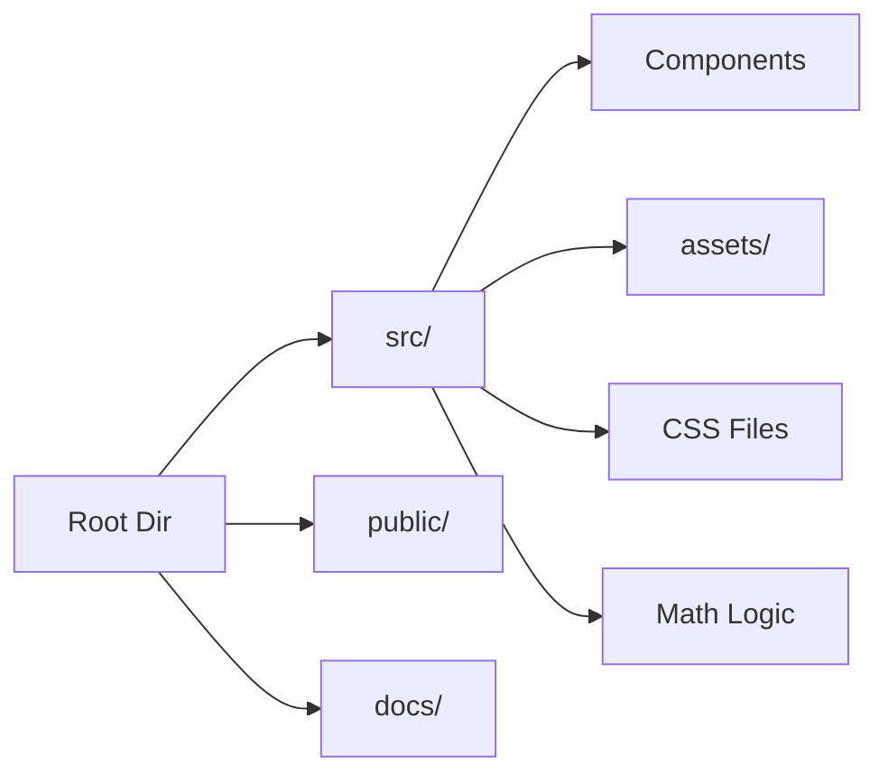

# Contributing to CalcPro

First off, thanks for taking the time to contribute! 🎉

The following is a set of guidelines for contributing to CalcPro. These are mostly guidelines, not rules. Use your best judgment, and feel free to propose changes to this document in a pull request.

## 🚀 How Can I Contribute?

### Reporting Bugs

This section guides you through submitting a bug report for CalcPro. Following these guidelines helps maintainers and the community understand your report, reproduce the behavior, and find related reports.

- **Use a clear and descriptive title** for the issue to identify the problem.
- **Describe the exact steps to reproduce the problem** in as much detail as possible.
- **Include screenshots or animated GIFs** which show you following the reproduction steps.

### Suggesting Enhancements

This section guides you through submitting an enhancement suggestion for CalcPro, including completely new features and minor improvements to existing functionality.

- **Use a clear and descriptive title** for the issue to identify the suggestion.
- **Provide a step-by-step description of the suggested enhancement** in as much detail as possible.
- **Explain why this enhancement would be useful** to most CalcPro users.

### Pull Requests

The process is straightforward:

1.  **Fork** the repo on GitHub.
2.  **Clone** the project to your own machine.
3.  **Commit** changes to your own branch.
4.  **Push** your work back up to your fork.
5.  Submit a **Pull Request** so that we can review your changes.

NOTE: Be sure to merge the latest from "upstream" before making a pull request!

## 💻 Development Setup

### Prerequisites

- Node.js >= 18.0.0
- npm >= 9.0.0

### Steps

1.  Clone the repo:
    ```bash
    git clone https://github.com/yourusername/calcpro.git
    ```
2.  Install dependencies:
    ```bash
    npm install
    ```
3.  Start the dev server:
    ```bash
    npm run dev
    ```

## 📐 Project Structure



- **src/**: Source code.
- **docs/**: Documentation files.
- **public/**: Static assets.

## 🎨 Styleguides

### JavaScript Styleguide

- We use **ESLint** to lint our code.
- Prefer **Functional Components** with Hooks.
- Use `const` and `let`, avoid `var`.

### Commit Messages

- Use the present tense ("Add feature" not "Added feature").
- Use the imperative mood ("Move cursor to..." not "Moves cursor to...").
- Limit the first line to 72 characters or less.
- Reference issues and pull requests liberally after the first line.

## 📜 License

By contributing, you agree that your contributions will be licensed under its MIT License.
