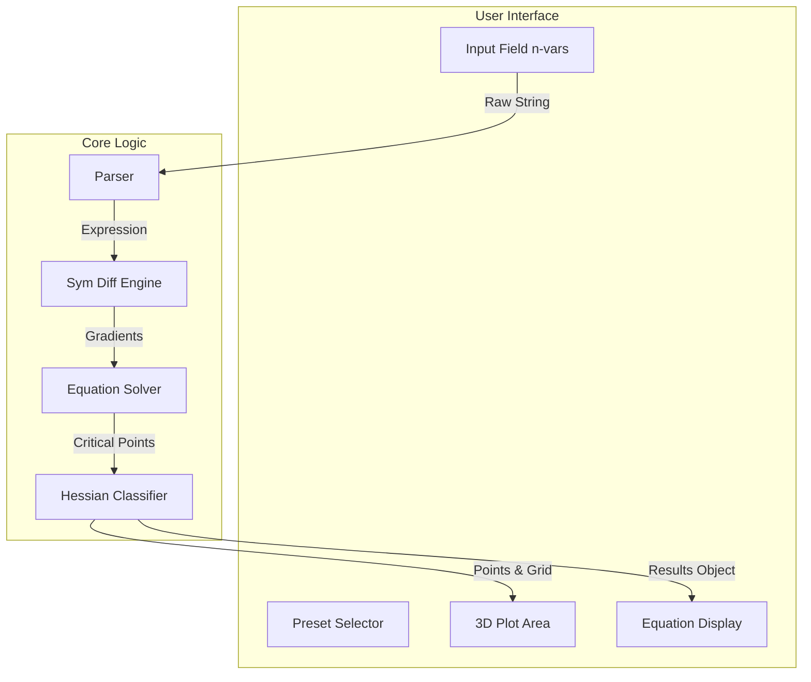

# CalcPro: Multivariable Calculus Extrema Analyzer


> **A powerful, real-time tool for analyzing and visualizing multivariable functions.**

## 📖 Overview

**CalcPro** is a modern React-based Single Page Application (SPA) built for calculus students, educators, and mathematics enthusiasts. It provides an intuitive interface to perform complex **extrema analysis** on functions with $N$ variables.

Unlike standard graphing calculators, CalcPro focuses on the **Calculus of Several Variables**, automatically computing gradients, Hessian matrices, and classifying critical points using Sylvester's Criterion.

## ✨ Key Features

- **🚀 Real-Time Analysis**: Instant algebraic computation as you type.
- **🔢 N-Variable Support**: Handles functions with any number of variables (e.g., $f(x, y, z, w)$).
- **📊 3D Visualization**: Interactive surface plots for 2-variable functions using Plotly.
- **⚡ Symbolic Math Engine**: Powered by `nerdamer` for precise symbolic differentiation and solving.
- **🎨 Beautiful UI**: Responsive design with Dark/Light mode support.
- **📝 LaTeX Rendering**: Professional-grade equation display.

## 🛠️ Technology Stack

This project leverages a modern web stack for performance and developer experience:

- **Frontend**: [React 19](https://react.dev/)
- **Build System**: [Vite](https://vitejs.dev/)
- **Math Engine**: [Nerdamer](https://nerdamer.com/)
- **Plotting**: [Plotly.js](https://plotly.com/javascript/)
- **Styling**: CSS Variables & Flexbox/Grid

## 🏗️ Architecture

CalcPro is designed with a unidirectional data flow. The application state is managed centrally, with the mathematical computation engine decoupled from the UI rendering.



For more details, check out the [Architecture Documentation](docs/ARCHITECTURE.md).

## 🚀 Getting Started

### Prerequisites

- **Node.js**: Version 18 or higher
- **npm**: Version 9 or higher

### Installation

1.  **Clone the repository**
    ```bash
    git clone https://github.com/zahid/calcpro.git
    cd calcpro
    ```

2.  **Install dependencies**
    ```bash
    npm install
    ```

3.  **Start the development server**
    ```bash
    npm run dev
    ```

4.  **Open in Browser**
    Visit `http://localhost:5173` to start analyzing functions!

## 📚 Documentation

We have detailed documentation available in the `docs/` directory:

| Document | Description |
|----------|-------------|
| [**User Guide**](docs/USER_GUIDE.md) | How to use the application, explaining features and UI controls. |
| [**Algorithm**](docs/ALGORITHM.md) | Deep dive into the math: Gradients, Hessians, and Sylvester's Criterion. |
| [**Architecture**](docs/ARCHITECTURE.md) | Technical overview of the codebase structure and component flow. |

## 🧪 Example Workflow

1.  **Input**: Users enters $f(x,y) = x^3 - 3xy^2$ (Monkey Saddle).
2.  **Processing**:
    - System detects variables: `[x, y]`
    - Calculates Gradient: $\nabla f = \langle 3x^2 - 3y^2, -6xy \rangle$
    - Solves $\nabla f = 0 \rightarrow (0,0)$
3.  **Classification**:
    - Computes Hessian at $(0,0)$.
    - Determinant is non-zero (or analyzes shape).
    - Classifies as **Saddle Point**.
4.  **Output**: Displays equations and renders a saddle shape in 3D.

## 🤝 Contributing

Contributions are welcome! Please read our [Contributing Guidelines](CONTRIBUTING.md) for details on our code of conduct, and the process for submitting pull requests.

## 📄 License

This project is licensed under the MIT License - see the [LICENSE](LICENSE) file for details.
