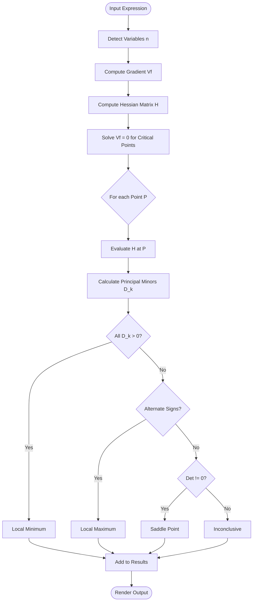

# Algebra & Calculus Algorithm

This document details the mathematical engine powering CalcPro. The application uses symbolic computation to analyze multivariate functions.

## Core Algorithm: Extrema Analysis

The analysis pipeline consists of 5 distinct steps executed sequentially.

### 1. Variable Detection
The engine scans the input expression string (e.g., `x^2 + y^2`) to identify variables.
- **Library**: `nerdamer`
- **Logic**: If no variables are found, defaults to `['x', 'y']`. It handles an arbitrary number of variables ($n$).

### 2. Gradient Computation (First Derivatives)
We calculate the Gradient Vector $\nabla f$, which contains the partial derivative with respect to each variable.

$$
\nabla f = \begin{bmatrix} \frac{\partial f}{\partial x_1} \\ \frac{\partial f}{\partial x_2} \\ \vdots \\ \frac{\partial f}{\partial x_n} \end{bmatrix}
$$

### 3. Hessian Matrix Construction (Second Derivatives)
We compute the Hessian Matrix $H(f)$, an $n \times n$ matrix of second-order partial derivatives.

$$
H(f) = \begin{bmatrix}
\frac{\partial^2 f}{\partial x_1^2} & \frac{\partial^2 f}{\partial x_1 \partial x_2} & \dots \\
\frac{\partial^2 f}{\partial x_2 \partial x_1} & \frac{\partial^2 f}{\partial x_2^2} & \dots \\
\vdots & \vdots & \ddots
\end{bmatrix}
$$

### 4. Critical Point Solution
To find critical points, we solve the system where the gradient is zero:
$$ \nabla f = \vec{0} $$
This involves solving $n$ simultaneous equations. The application handles symbolic solutions and attempts to convert them to real floating-point coordinates.

### 5. Classification (Sylvester's Criterion)
For each valid critical point, we evaluate the Hessian Matrix at that point (plugging in the coordinates). We then calculate the **Principal Minors** ($D_k$) to classify the point.

- **Local Minimum**: All Principal Minors are positive ($D_k > 0$ for all $k$). Matrix is *Positive Definite*.
- **Local Maximum**: Principal Minors alternate signs ($D_1 < 0, D_2 > 0, D_3 < 0 \dots$). Matrix is *Negative Definite*.
- **Saddle Point**: $det(H) \neq 0$ but does not fit the above patterns. Matrix is *Indefinite*.
- **Inconclusive**: $det(H) = 0$.

## Algorithm Flowchart

