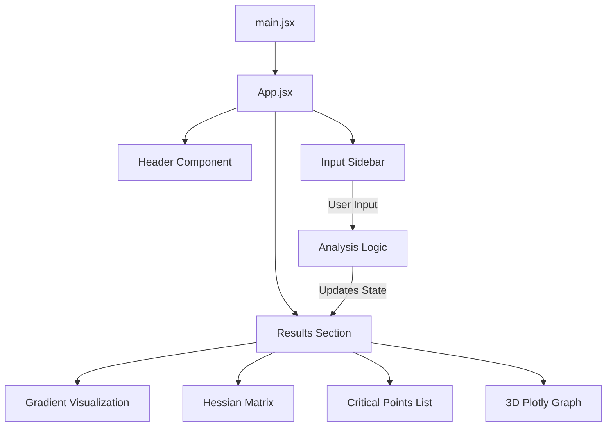
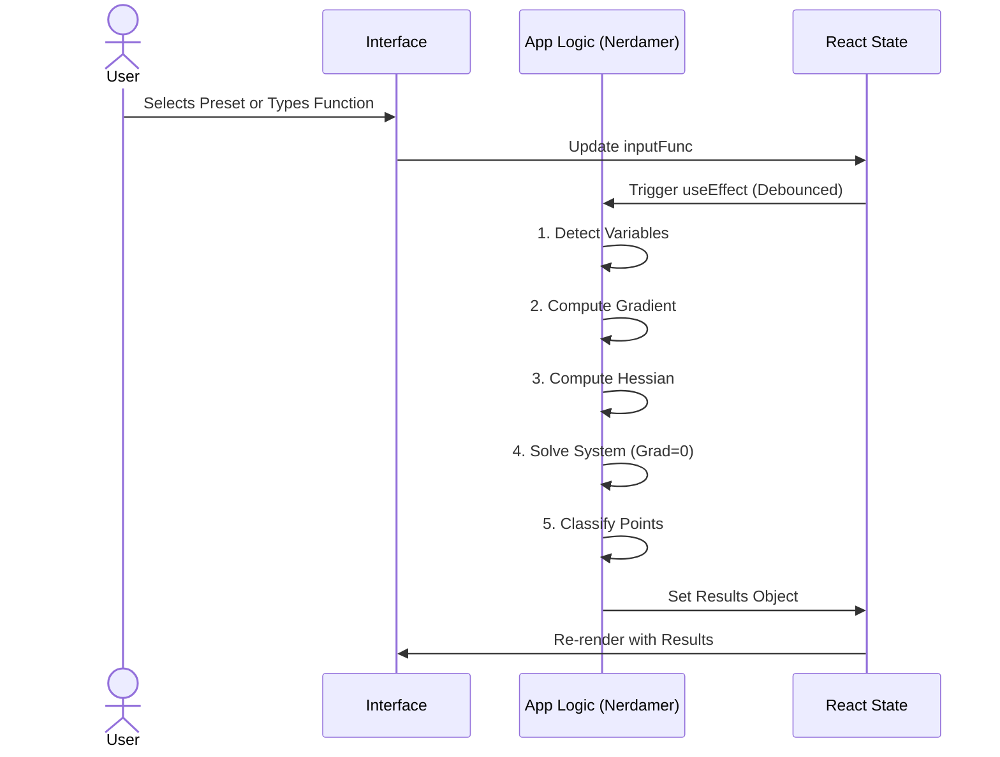

# Architecture Documentation

## Overview
**CalcPro** is a React-based single-page application (SPA) designed to perform extrema analysis on multivariable functions. It serves as an educational tool for calculus students and professionals, enabling real-time computation of Gradients, Hessian Matrices, and Critical Points.

## Technology Stack

| Category | Technology | Purpose |
|----------|------------|---------|
| **Frontend Framework** | React 19 | UI Component structure and state management. |
| **Build Tool** | Vite | Fast development server and bundling. |
| **Math Engine** | Nerdamer | Symbolic differentiation and equation solving. |
| **Visualization** | Plotly.js | Interactive 3D surface plotting. |
| **Rendering** | KaTeX / React-Latex | High-quality mathematical equation rendering. |

## Project Structure

The project follows a standard Vite + React structure.

```
/
├── public/              # Static assets
├── src/
│   ├── assets/          # Project images/icons
│   ├── App.jsx          # Main Application Logic (Monolith)
│   ├── App.css          # Component-specific styles
│   ├── index.css        # Global styles and variables
│   └── main.jsx         # Entry point
├── docs/                # Documentation
└── package.json         # Dependencies and scripts
```

## Component Architecture

Currently, the application uses a centralized logical structure within `App.jsx`.



## Data Flow

The application follows a unidirectional data flow powered by React's `useState`.


