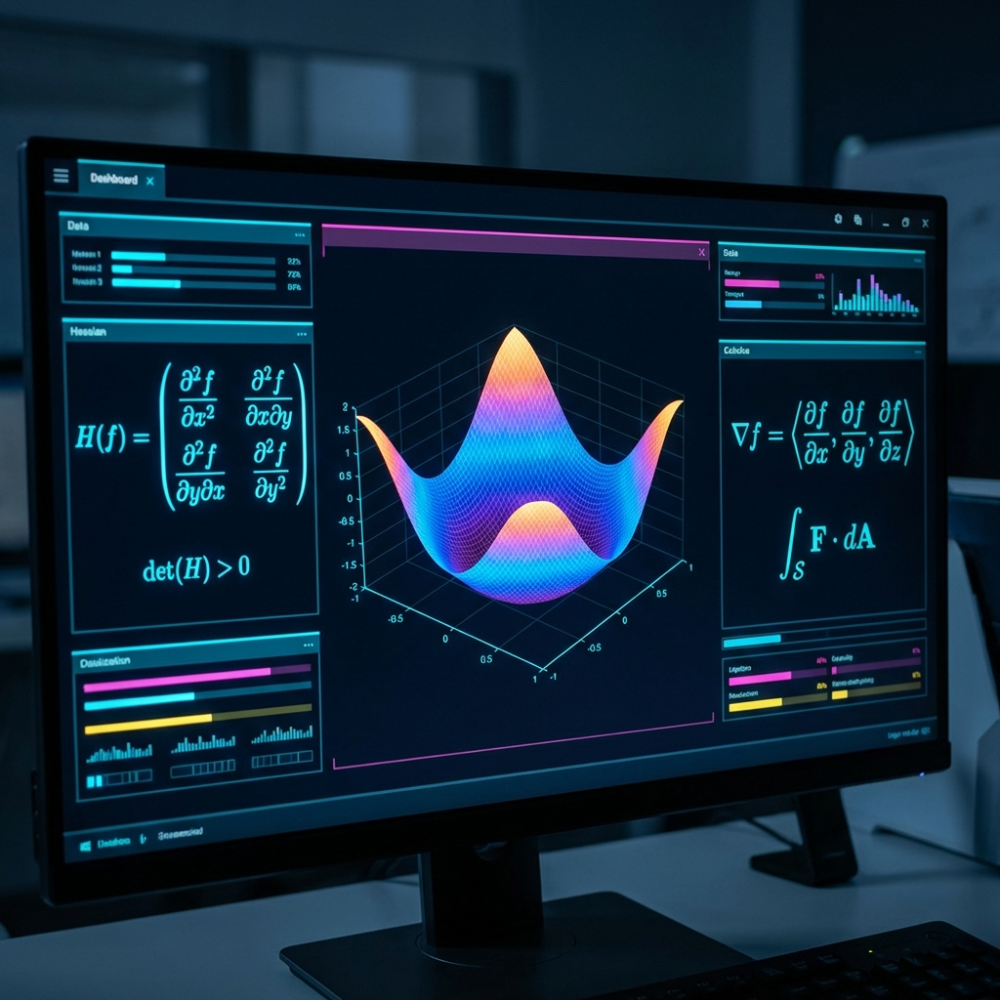
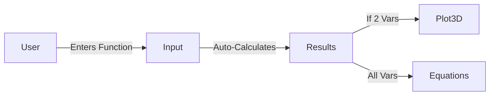

# CalcPro User Guide

## Introduction
Welcome to **CalcPro**, the advanced multivariable calculus analysis tool. This integrated dashboard allows you to explore the behavior of complex functions in real-time, visualizing surfaces and calculating critical extrema points automatically.

## Getting Started

1.  **Open the Application**: Launch the web app in your browser.
2.  **Select a Function**:
    *   **Presets**: Use the dropdown menu in the sidebar to choose classic examples like "Monkey Saddle" or "Simple Minimum".
    *   **Custom**: Type your own mathematical expression in the input field.
        *   Supported variables: `x`, `y`, `z`, etc. (The system auto-detects them).
        *   Operations: `+`, `-`, `*`, `/`, `^`, `sin()`, `cos()`, `exp()`, etc.

## Features

### 1. Extrema Analysis
Review the step-by-step breakdown of the calculus performed on your function:
*   **Gradient Vector**: See the first derivatives.
*   **Hessian Matrix**: View the matrix of second derivatives.
*   **Classification**: The system identifies points as **Local Minima**, **Local Maxima**, or **Saddle Points**.

### 2. Interactive Visualization
For functions with 2 variables (e.g., $f(x,y)$), the dashboard generates a 3D interactive plot.
*   **Rotate**: Click and drag to inspect the surface from different angles.
*   **Zoom**: Scroll to zoom in/out.
*   **Critical Points**: Colored spheres indicate the location of extrema on the surface.
    *   ● **Green**: Minima
    *   ● **Red**: Maxima
    *   ● **Orange**: Saddle

### 3. Theme Customization
Toggle between **Light** and **Dark** modes using the sun/moon icon in the top right corner. The charts and LaTeX equations adapt automatically.

## Troubleshooting

| Issue | Solution |
|-------|----------|
| **"Inconclusive" Result** | The Determinant of the Hessian is 0. This is a degenerate case that requires higher-order derivative tests, which are not yet supported. |
| **No Plot appears** | Plotting is only supported for 2 variables (3D space). If you have 3+ variables, only the algebraic analysis is shown. |
| **Syntax Error** | Ensure you use `*` for multiplication (e.g., `3*x` not `3x`). |

